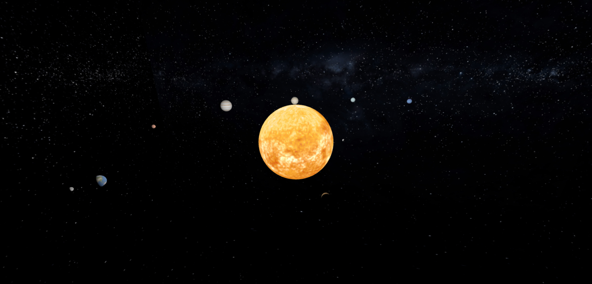
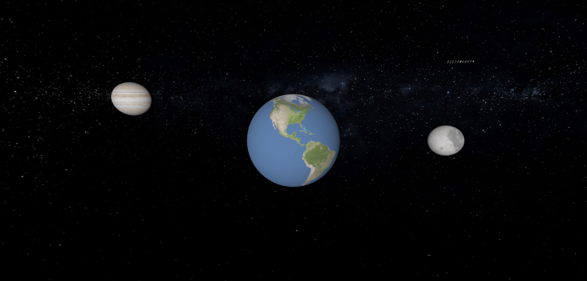
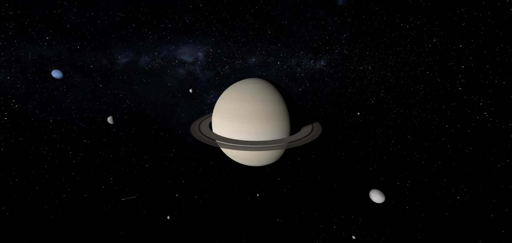
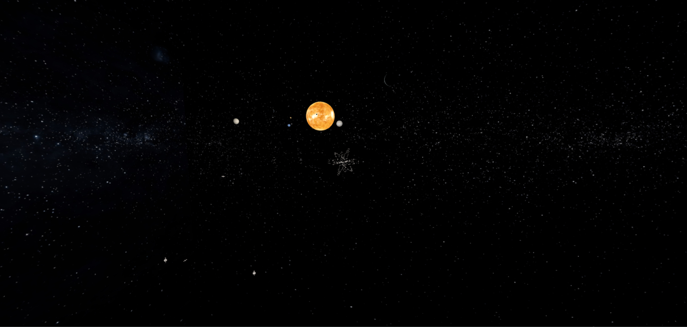

# Solar-System
 Solar System using Three.JS

 ## How to Install
 1. Clone the repository
 2. Run `npm install`

 ## How to Use
1. Run `npx vite`
2. Open `localhost:5173` in your browser
3. Enjoy!

## Controls
- `Mouse Click + Drag` to rotate the camera
- `Mouse Right Click + Drag` to pan the camera
- `Mouse Wheel` to zoom in/out
- `Mouse Click` to Focus on an object when clicked
- `Esc` to reset the camera

## Screenshots

## Credits
- [Three.JS](https://threejs.org/)
- [Vite](https://vitejs.dev/)
- [Planets Textures](https://www.solarsystemscope.com/textures/)
- [Skybox](https://www.solarsystemscope.com/textures/)
- [Saiyan Space Pod (didn't use)](https://skfb.ly/6XPyA)
- [Saturn Ring](https://www.deviantart.com/alpha-element/art/Stock-Image-Saturn-Rings-393767006)
